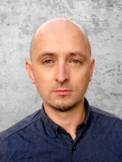
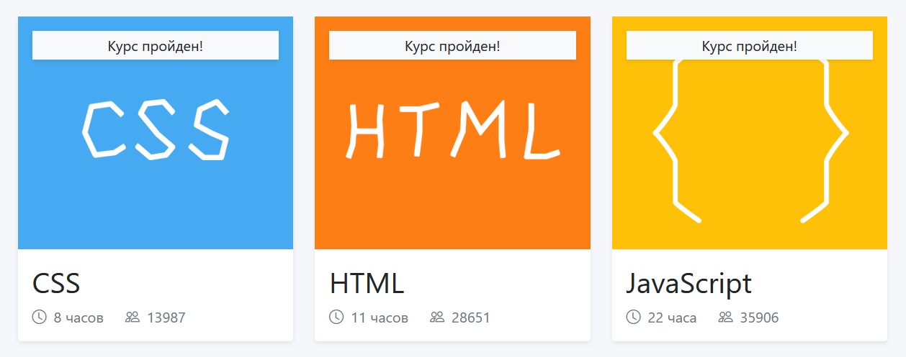

# Ivan Hryhoriev

## Contact information:

_Phone:_        **+1 (720) 654 4351** \
_Address:_      **Denver, CO, USA**  \
_E-mail:_       **ih@web-architect.pro** \
_Telegram:_     **[Ivan_Gricyan](@Jan_Grycan)** \
_Discord:_      **[Ivan Gricyan](https://discordapp.com/users/728380730018889869/)** \
_Linkedin:_     **[ivanhryhoriev](https://www.linkedin.com/in/ivanhryhoriev/)**

## Summary:

| &nbsp;&nbsp;&nbsp;&nbsp;&nbsp;&nbsp;&nbsp;&nbsp;&nbsp;&nbsp;&nbsp;&nbsp;&nbsp;&nbsp;&nbsp;&nbsp;&nbsp;&nbsp;&nbsp;&nbsp;&nbsp;&nbsp;&nbsp;&nbsp;&nbsp;&nbsp;&nbsp;&nbsp;&nbsp;&nbsp;&nbsp;&nbsp;&nbsp;&nbsp;&nbsp;&nbsp;|  Briefly about myself... |
| :---        |    :----  |
|      | I was interested in information technologies when I was in high school, and I even attended a programming class. We learned how to create simple games in Pascal. Oh yeah, I'm such an old one )). But at university, my choice fell on an jurisprudence and I worked in court for several years. There I learnt these skills well: **punctuality**, **meticulousness** and **stress tolerance**. Meanwhile, creating things has always fascinated me, and about six years ago I made my first website for the company I was employed. The process involved me so much that I could sit for hours and hours figuring out how it worked. Later, when I moved to Wasraw, **I finished a post-secondary school studying web development**. Currently I have a few pet projects. But it's still like a hobby of mine. |

## Skills and Proficiency:

* Vue, Laravel
* HTML5, CSS3, PHP, SQL
* JavaScript Basics
* GitHub, VS Code
* Adobe Photoshop, Illustrator
* Wordpress, Joomla, Danneo

## Education:

* **Cosinus Secondary School**
    * *Specialisation*: **Information Technology Technician**
    * *Professional qualifications*:
        * **EE.08** *Installation and operation of computer systems, peripheral devices and networks*
        * **EE.09** *Programming, development and administration of websites and databases*


* **Khmelnytsky University of Management and Law**
    * *Specialization*: **Civil Law**
    * *Educational level*: **Master's degree**

## Trainings and courses:

* **English Translator** - First Kiev Foreign Language Courses
* **IT Essential**: *PC Hardware and Software* - Cisco Networking Academy
* **[CCNAv7](https://www.credly.com/badges/72883930-5411-44c6-a176-095d591a15d6?source=linked_in_profile)**: *Introduction to Networks* - Cisco Networking Academy
* **HTML, CSS, JS Basics** - **[Sololearn](https://www.sololearn.com/profile/23960808)** and **[Code-basics](https://code-basics.com/)**



## Code example:

> "Talk is cheap. Show me the code." \
`Linus Torvalds said these words.`
`The idea of code below I took from the internet, modified it, and it works well for me.`

```javascript
function reverse(n) {
  let str = String(Math.abs(n));
  let result = '';
  for (let i = 0; i &#60; str.length; i++) {

      result = `${str[i]}${result}`
  }
  return result;
}
```

## Languages:

* **Russian** (*native*)
* **Ukrainian** (*native*)
* **Polish** (*B1*)
* **English** (*B1*)

---
